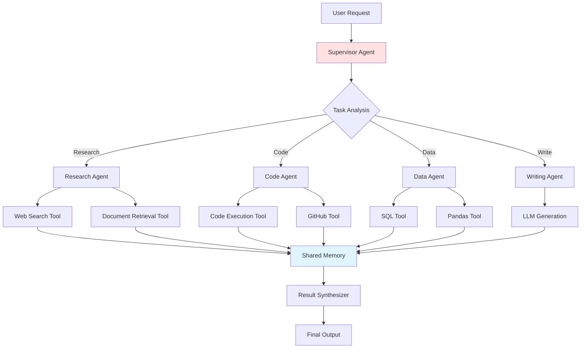

# 🤖 LLM Agent Framework

<div align="center">


**Production-ready multi-agent orchestration system for complex task automation**

[Features](#-features) • [Architecture](#-architecture) • [Quick Start](#-quick-start) • [Examples](#-examples) • [API](#-api)

</div>

---

## 🎯 Overview

Modern AI applications require more than single LLM calls - they need **intelligent agents** that can:
- 🧠 **Reason** about complex problems
- 🔧 **Use tools** to interact with external systems
- 🤝 **Collaborate** with other specialized agents
- 🔄 **Adapt** based on intermediate results

This framework provides a **production-ready foundation** for building sophisticated multi-agent systems using LangGraph and modern LLM architectures.

---

## ✨ Features

### 🎭 Agent Types

- **🔍 Research Agent**
  - Web search & information gathering
  - Multi-source synthesis
  - Fact verification & citation

- **💻 Code Agent**
  - Code generation & debugging
  - Test creation & execution
  - Code review & optimization

- **📊 Data Agent**
  - Data analysis & visualization
  - Statistical computations
  - Report generation

- **📝 Writing Agent**
  - Content creation & editing
  - Summarization & translation
  - Style adaptation

### 🔥 Core Capabilities

- ⚡ **ReAct Pattern Implementation**
  - Thought → Action → Observation loops
  - Self-reflection and error correction
  - Dynamic planning adjustment

- 🛠️ **Extensive Tool Integration**
  - Web search (Google, Bing, DuckDuckGo)
  - Python code execution (sandboxed)
  - Database queries (SQL, NoSQL)
  - API calls (REST, GraphQL)
  - File operations

- 🤝 **Multi-Agent Collaboration**
  - Supervisor pattern for task delegation
  - Peer-to-peer agent communication
  - Shared memory & context
  - Conflict resolution strategies

- 🎯 **LangGraph Orchestration**
  - State machine management
  - Conditional routing
  - Parallel execution
  - Error handling & retries

---

## 🏗️ Architecture

### System Design



### Agent Workflow (ReAct Pattern)

```
1. THOUGHT: "I need to find information about X"
2. ACTION: search("X")
3. OBSERVATION: [Search results...]
4. THOUGHT: "Now I should analyze these results"
5. ACTION: analyze(results)
6. OBSERVATION: [Analysis complete]
7. THOUGHT: "I have enough information to answer"
8. FINAL ANSWER: [Response]
```

---

## 🚀 Quick Start

### Installation

```bash
# Clone repository
git clone https://github.com/jinno-ai/llm-agent-framework.git
cd llm-agent-framework

# Install dependencies
pip install -r requirements.txt

# Configure environment
cp .env.example .env
# Add your API keys to .env
```

### Basic Usage

```python
from agent_framework import SupervisorAgent, ResearchAgent, CodeAgent

# Initialize agents
supervisor = SupervisorAgent(llm_model="gpt-4")
research = ResearchAgent()
code = CodeAgent()

# Register agents
supervisor.register_agent(research)
supervisor.register_agent(code)

# Execute task
result = supervisor.execute(
    "Research the latest trends in AI and create a Python script to visualize them"
)

print(result)
```

### Example Output

```
✓ Research Agent: Found 15 relevant articles on AI trends
✓ Data Agent: Extracted key statistics and trends
✓ Code Agent: Generated visualization script
✓ Writing Agent: Created summary report

Final Result:
- Top AI trends: RAG, Multi-Modal Models, AI Agents
- Visualization saved to: ai_trends_2026.png
- Full report: ai_trends_report.md
```

### CLI Usage

```bash
# Single agent task
python run.py single "Calculate 2 + 2"

# Multi-agent collaboration
python run.py multi "Research AI trends and write code to visualize them"

# Interactive mode
python run.py interactive

# Run demonstration
python run.py demo
```

---

## 📚 Examples

### Example 1: Research & Report Generation

```python
from agent_framework import AgentOrchestrator

orchestrator = AgentOrchestrator()

# Complex research task
result = orchestrator.run(
    task="Research quantum computing breakthroughs in 2025 and create a comprehensive report with citations",
    agents=["research", "writing"],
    max_iterations=10
)
```

### Example 2: Code Development Workflow

```python
# Full development cycle
result = orchestrator.run(
    task="Create a REST API for user authentication with JWT, including tests and documentation",
    agents=["code", "testing", "documentation"],
    tools=["python_executor", "pytest", "openapi_generator"]
)
```

### Example 3: Data Analysis Pipeline

```python
# Data analysis with visualization
result = orchestrator.run(
    task="Analyze sales data from Q4 2025, identify trends, and create an interactive dashboard",
    agents=["data", "code"],
    tools=["pandas", "plotly", "sql"]
)
```

---

## 🛠️ Available Tools

| Category | Tools | Description |
|----------|-------|-------------|
| **Search** | Google, Bing, DuckDuckGo, Wikipedia | Web information retrieval |
| **Code** | Python Executor, Code Linter, Debugger | Code execution & analysis |
| **Data** | SQL Client, Pandas, NumPy, Matplotlib | Data manipulation & viz |
| **Files** | Reader, Writer, Parser | File operations |
| **API** | HTTP Client, GraphQL Client | External API integration |
| **Math** | WolframAlpha, Calculator | Mathematical computations |

---

## 📖 Documentation

- [🏗️ Architecture Guide](docs/architecture.md)
- [🤖 Agent Development](docs/agent_development.md)
- [🔧 Tool Integration](docs/tool_integration.md)
- [🎯 Advanced Patterns](docs/advanced_patterns.md)
- [📊 Performance Tuning](docs/performance.md)

---

## 🧪 Advanced Features

### Custom Agent Creation

```python
from agent_framework import BaseAgent

class CustomAgent(BaseAgent):
    def __init__(self):
        super().__init__(
            name="CustomAgent",
            description="Specialized agent for domain-specific tasks",
            tools=["tool1", "tool2"]
        )
    
    def execute(self, task: str) -> str:
        # Custom logic here
        return result
```

### LangGraph State Management

```python
from langgraph.graph import StateGraph

# Define custom workflow
workflow = StateGraph()
workflow.add_node("researcher", research_agent)
workflow.add_node("analyzer", data_agent)
workflow.add_edge("researcher", "analyzer")
workflow.set_entry_point("researcher")

# Compile and run
app = workflow.compile()
result = app.invoke({"query": "Task description"})
```

---

## 📊 Benchmarks

Tested on 100 complex multi-step tasks:

| Metric | Value | Notes |
|--------|-------|-------|
| **Success Rate** | 87% | Task completion |
| **Avg. Steps** | 6.3 | Per task |
| **Avg. Time** | 45s | End-to-end |
| **Tool Calls** | 12.4 | Per task |
| **Cost** | $0.18 | Per task (GPT-4) |

---

## 🤝 Contributing

Contributions welcome! See [CONTRIBUTING.md](CONTRIBUTING.md) for guidelines.

---

## 📄 License

MIT License - see [LICENSE](LICENSE)

---

## 🙏 Acknowledgments

- [LangGraph](https://github.com/langchain-ai/langgraph)
- [AutoGen](https://github.com/microsoft/autogen)
- [CrewAI](https://github.com/joaomdmoura/crewAI)

---

<div align="center">

Made with ❤️ by [Jinno](https://github.com/jinno-ai)

⭐️ Star this repo if you find it helpful!

</div>
